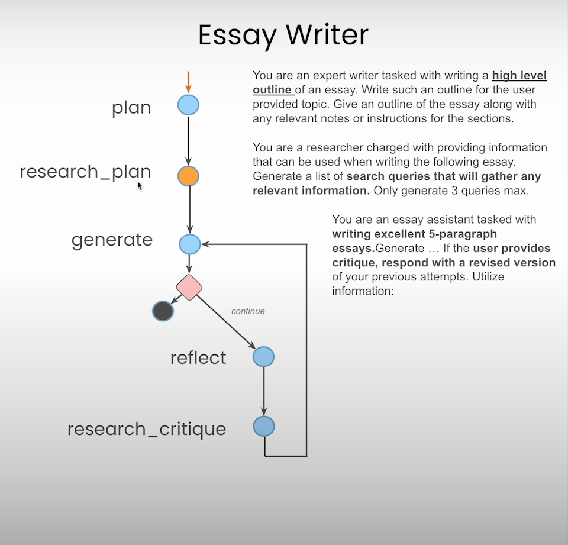

# Deep Research Using Agent

To get started with the Deep Research Using Agent, follow these steps:

1. **Clone the repository**
   ```bash
   git clone https://github.com/lovesickness111/demo-deep-research.git
   cd demo-deep-research
   ```

2. **Set up virtual environment and install dependencies**
   ```bash
   python3 -m venv venv
   source venv/bin/activate   # On Windows use `venv\Scripts\activate`
   pip install -r requirements.txt
   ```

3. **Create and configure the `.env` file**
   Create a `.env` file in the root directory and assign the necessary API keys:
   ```env
   OPENAI_API_KEY=sk-....
   TAVILY_API_KEY=tvly-.....
   ```

4. **Run the application**
   ```bash
   python app.py
   ```

#### Multi-agent designs

1. **Focused Tools:** Grouping tools by responsibility enhances performance as agents perform better with focused tasks than when choosing from many tools.
2. **Separate Prompts:** Using distinct prompts with specific instructions and examples improves results. Each agent can even use a separate fine-tuned LLM.
3. **Modular Development:** Evaluating and improving each agent individually is easier and doesn't affect the larger application.
4. **Divide and Conquer:** Multi-agent designs break complex problems into manageable tasks, allowing specialized agents and LLM programs to target each unit effectively.

### Agent Connection




#### References:
- [LangGraph Documentation](https://blog.langchain.dev/langgraph/)
- [LangGraph: Multi-Agent Workflows](https://blog.langchain.dev/langgraph-multi-agent-workflows/)
- [Adaptive RAG](https://langchain-ai.github.io/langgraph/tutorials/rag/langgraph_adaptive_rag/)
- [CrewAI Documentation](https://docs.crewai.com/core-concepts/Agents/)
- [GPTResearcher Github](https://github.com/assafelovic/gpt-researcher?ref=blog.langchain.dev)
